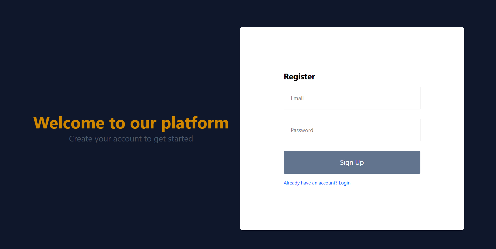
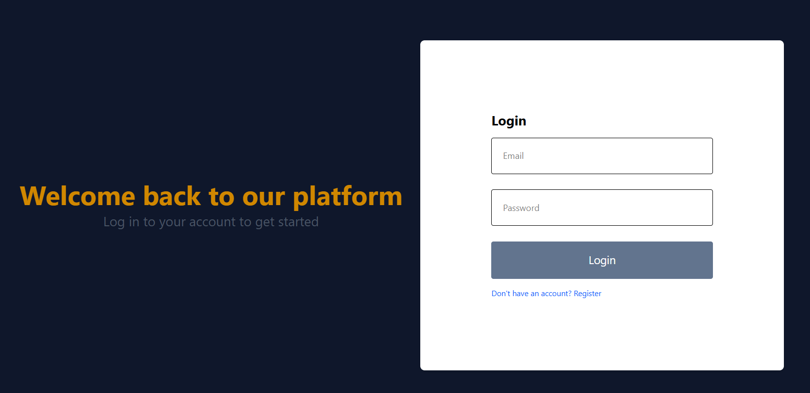
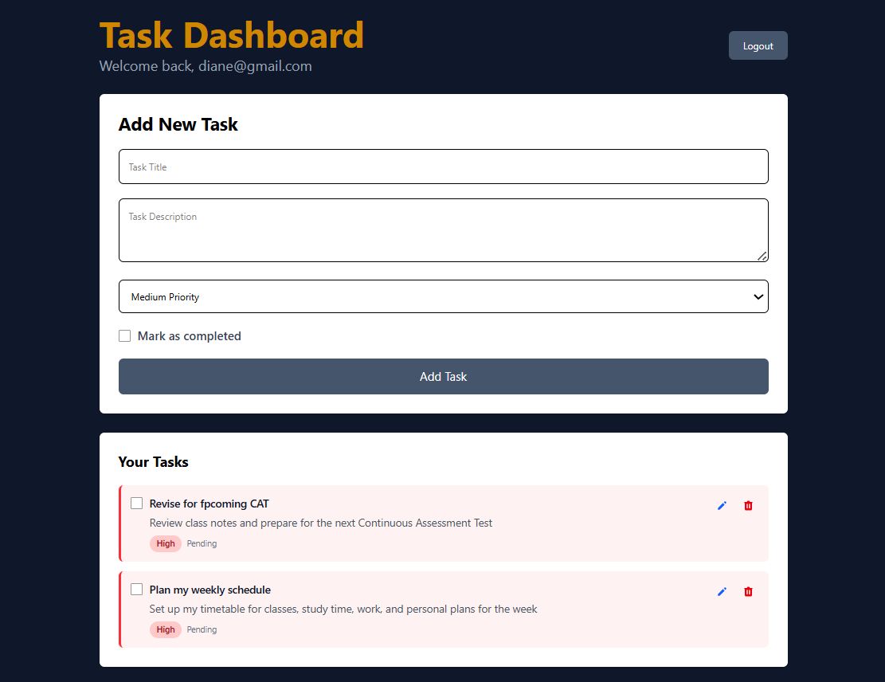

# Task Management App

A modern task management application built with Next.js, React, and Firebase. Organize your tasks, set priorities, and track your productivity.

## Features

- Create, edit, and delete tasks
- Categorize tasks with tags
- Set due dates and priorities
- Search and filter tasks
- Responsive design for all devices
- Secure authentication with Firebase

## Tech Stack

- **Frontend**: Next.js 16, React 19, TypeScript
- **Styling**: Tailwind CSS
- **Backend**: Firebase (Authentication, Firestore)
- **State Management**: React Context API
- **Form Handling**: React Hook Form
- **Date Handling**: date-fns

## Project Structure

-task-management-app/
-└── firebase/
-├── public/
-│   └── images/
-│
-├── src/
-│   └── app/
-│       ├── (authentication)/
-│       │   ├── login/
-│       │   │   └── page.tsx
-│       │   └── register/
-│       │       └── page.tsx
-│       │
-│       ├── dashboard/
-│       │   └── page.tsx
-│       │
-│       ├── lib/
-│       │   └── firebase.ts
-│       │
-│       ├── globals.css
-│       ├── layout.tsx
-│       └── page.tsx
-│
-├── .eslintrc.json
-├── .gitignore
-├── next.config.js
-├── package.json
-├── postcss.config.js
-├── tailwind.config.js
-└── tsconfig.json


### Installation

1. Clone the repository:
   ```bash
   git clone [https://github.com/nclaira/task-management-app]

   cd task-management-app/firebase

Install dependencies:
bash
npm install
# or
yarn install
Set up Firebase:
Create a new Firebase project
Enable Authentication (Email/Password)
Set up Firestore database
Create a .env.local file with your Firebase config:
NEXT_PUBLIC_FIREBASE_API_KEY=your-api-key
NEXT_PUBLIC_FIREBASE_AUTH_DOMAIN=your-project.firebaseapp.com
NEXT_PUBLIC_FIREBASE_PROJECT_ID=your-project-id
NEXT_PUBLIC_FIREBASE_STORAGE_BUCKET=your-bucket.appspot.com
NEXT_PUBLIC_FIREBASE_MESSAGING_SENDER_ID=your-sender-id
NEXT_PUBLIC_FIREBASE_APP_ID=your-app-id
Run the development server:
bash
npm run dev
# or
yarn dev
Open http://localhost:3000 in your browser.

## Available Scripts

npm run dev - Start development server
npm run build - Build for production
npm start - Start production server
npm run lint - Run ESLint
npm test - Run tests

## Contributing
Contributions are welcome! Please follow these steps:

Fork the repository
Create a new branch (git checkout -b feature/AmazingFeature)
Commit your changes (git commit -m 'Add some AmazingFeature')
Push to the branch (git push origin feature/AmazingFeature)
Open a Pull Request

## License
This project is licensed under the MIT License - see the LICENSE file for details.

## Acknowledgments
Next.js
Firebase
Tailwind CSS

## screenshots

## register page


## login page


## dashboard page

